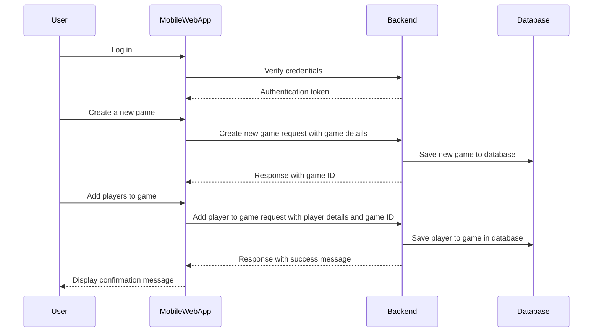

```mermaid
sequenceDiagram
    participant User
    participant MobileWebApp
    participant Backend
    participant Database

    User->>MobileWebApp: Log in
    MobileWebApp->>Backend: Verify credentials
    Backend-->>MobileWebApp: Authentication token
    User->>MobileWebApp: Create a new game
    MobileWebApp->>Backend: Create new game request with game details
    Backend->>Database: Save new game to database
    Backend-->>MobileWebApp: Response with game ID
    User->>MobileWebApp: Add players to game
    MobileWebApp->>Backend: Add player to game request with player details and game ID
    Backend->>Database: Save player to game in database
    Backend-->>MobileWebApp: Response with success message
    MobileWebApp-->>User: Display confirmation message

```
